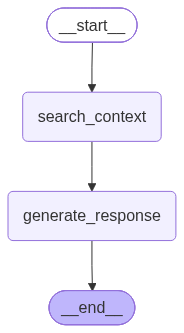

# 🛍️ BimBam Buy - Agente Inteligente RAG

Agente inteligente desarrollado para **BimBam Buy**, un e-commerce multiplataforma enfocado en ofrecer una experiencia de compra rápida, segura y confiable.

El proyecto implementa una arquitectura **RAG (Retrieval-Augmented Generation)** que permite responder preguntas utilizando exclusivamente la información contenida en la documentación oficial de la empresa.

La aplicación cuenta con una interfaz web desarrollada en **Streamlit**, utiliza **Google Gemini** como modelo de lenguaje, **FAISS** como base vectorial para la recuperación de información y **LangGraph** para orquestar el flujo del agente.

---

# 🚀 Características

- Consulta documentos PDF de la empresa.
- Recuperación semántica mediante embeddings.
- Índice vectorial con FAISS.
- Generación de respuestas usando Google Gemini.
- Interfaz conversacional moderna desarrollada con Streamlit.
- Arquitectura basada en LangGraph.
- Respuestas limitadas únicamente al contexto recuperado (sin alucinaciones).

---

# 📁 Arquitectura de la solución

El flujo completo del agente es el siguiente:

1. El usuario realiza una pregunta desde la interfaz.
2. LangGraph inicia la ejecución del flujo.
3. Se consulta el índice vectorial FAISS.
4. Se recuperan los fragmentos más relevantes.
5. Los fragmentos recuperados se envían al modelo Gemini mediante un Prompt Template.
6. Gemini genera una respuesta basada únicamente en el contexto recuperado.
7. La respuesta es mostrada al usuario en la interfaz.

## Flujo del agente

<p align="center">



</p>

---

# 🏗 Arquitectura del proyecto

```
Usuario
    │
    ▼
Interfaz Streamlit
    │
    ▼
LangGraph
    │
    ├──────────────► search_context()
    │                     │
    │                     ▼
    │               FAISS Retriever
    │                     │
    │                     ▼
    │            Fragmentos relevantes
    │
    ▼
generate_response()
    │
    ▼
Google Gemini
    │
    ▼
Respuesta final
```

---

# 📂 Estructura del proyecto

```text
BimBamBuy/
│
├── assets/
│     └── grafo_flujo.png
│
├── src/
│     ├── documents/
│     │      ├── Guía de Envíos.pdf
│     │      ├── Garantías.pdf
│     │      ├── Políticas.pdf
│     │      └── ...
│     │
│     ├── faiss_index/
│     ├── agente.py
│     ├── grafo.py
│     ├── vectorstore.py
│     └── app.py
│
├── .env
├── requirements.txt
└── README.md
```

---

# 🧠 Tecnologías utilizadas

| Tecnología | Descripción |
|------------|-------------|
| Python 3.14.6 | Lenguaje principal |
| Streamlit | Interfaz web |
| Google Gemini | Modelo de lenguaje |
| Google Embeddings | Generación de embeddings |
| LangChain | Construcción del pipeline RAG |
| LangGraph | Orquestación del flujo del agente |
| FAISS | Base de datos vectorial |
| PyMuPDF | Lectura de documentos PDF |
| dotenv | Variables de entorno |

---

# ⚙️ Instalación

## 1. Clonar el repositorio

```bash
git clone https://github.com/vivihv013/BIMBAMBUY-PROJECT.git
```

Entrar al proyecto

```bash
cd BIMBAMBUY-PROJECT
```

---

## 2. Crear un entorno virtual

Windows

```bash
python -m venv venv
```

Activarlo

```bash
venv\Scripts\activate
```

Linux / Mac

```bash
python3 -m venv venv

source venv/bin/activate
```

---

## 3. Instalar dependencias

```bash
pip install -r requirements.txt
```

---

## 4. Configurar variables de entorno

Crear un archivo

```
.env
```

con el siguiente contenido

```env
GEMINI_API_KEY=TU_API_KEY

MODELO_GEMINI=gemini-3.5-flash-lite

MODELO_EMBEDDING=gemini-embedding-001
```

---

## 5. Agregar la documentación

Copiar los documentos PDF dentro de

```
src/documents/
```

---

## 6. Ejecutar la aplicación

Desde la carpeta **src**

```bash
streamlit run app.py
```

---

# 📚 Funcionamiento del sistema

Cuando el sistema inicia por primera vez:

- Se leen todos los documentos PDF.
- Se generan embeddings.
- Se crea el índice FAISS.
- El índice queda almacenado localmente.

En las siguientes ejecuciones:

- El índice FAISS es cargado automáticamente.
- No es necesario volver a procesar los documentos.

Esto mejora significativamente el tiempo de respuesta.

---

# 💬 Ejemplos de preguntas

El agente puede responder preguntas como:

- ¿Cuánto tarda un envío?
- ¿Cómo funciona la garantía de un producto?
- ¿Cuál es la política de devoluciones?
- ¿Qué métodos de pago acepta BimBam Buy?
- ¿Cómo funciona el programa de afiliados?
- ¿Qué sucede si mi pedido llega incompleto?
- ¿Puedo solicitar un reembolso?
- ¿Cuáles son los tiempos de entrega?
- ¿Cómo puedo rastrear mi pedido?

---

# 🤖 Ejemplos de respuestas

### Pregunta

> ¿Qué métodos de pago acepta BimBam Buy?

Respuesta

> BimBam Buy acepta diferentes métodos de pago disponibles durante el proceso de compra. Los métodos específicos se muestran al momento de realizar el pago y pueden incluir tarjetas, transferencias y otros medios autorizados según la documentación disponible.

---

### Pregunta

> ¿Cómo solicito un reembolso?

Respuesta

> Puedes solicitar un reembolso siguiendo el procedimiento indicado en la Política de Reembolsos y Devoluciones. Es importante cumplir con los requisitos y tiempos establecidos para que la solicitud pueda ser evaluada.

---

### Pregunta

> ¿Cuánto tarda un envío?

Respuesta

> El tiempo de entrega depende del destino y del tipo de envío seleccionado. La información detallada sobre los tiempos estimados se encuentra en la Guía de Tiempos y Costos de Envío de BimBam Buy.

---

### Pregunta

> ¿Cuál es la sede principal de la empresa?

Respuesta

> No dispongo de esa información en este momento. 😊 Si lo deseas, puedo ayudarte con consultas relacionadas con pedidos, logística, tiempos de entrega, envíos, pagos o políticas disponibles en la información que tengo.

---

# 🔒 Restricciones del agente

El agente fue diseñado para:

- Responder únicamente con información presente en los documentos.
- No inventar respuestas.
- No inferir información inexistente.
- Mantener un lenguaje claro, profesional y amigable.
- Informar cuando la información solicitada no se encuentra disponible.

---

# 👨‍💻 Autora: **Viviana Hurtado**

Proyecto desarrollado como evidencia de implementación de un **Agente Inteligente RAG** utilizando Google Gemini, LangGraph, FAISS y Streamlit.
